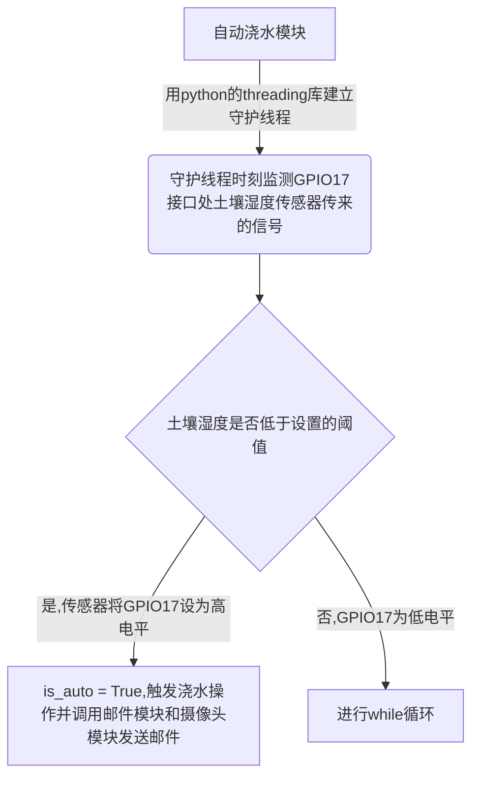

```mermaid
graph TD
    A[自动浇水模块] -->|用python的threading库建立守护线程| B(守护线程时刻监测GPIO17接口处土壤湿度传感器传来的信号)
    B --> C{土壤湿度是否低于设置的阈值}
    
    C -->|是,传感器将GPIO17设为高电平| E[is_auto = True,触发浇水操作并调用邮件模块和摄像头模块发送邮件]
    C -->|否,GPIO17为低电平| F[进行while循环]
  
```